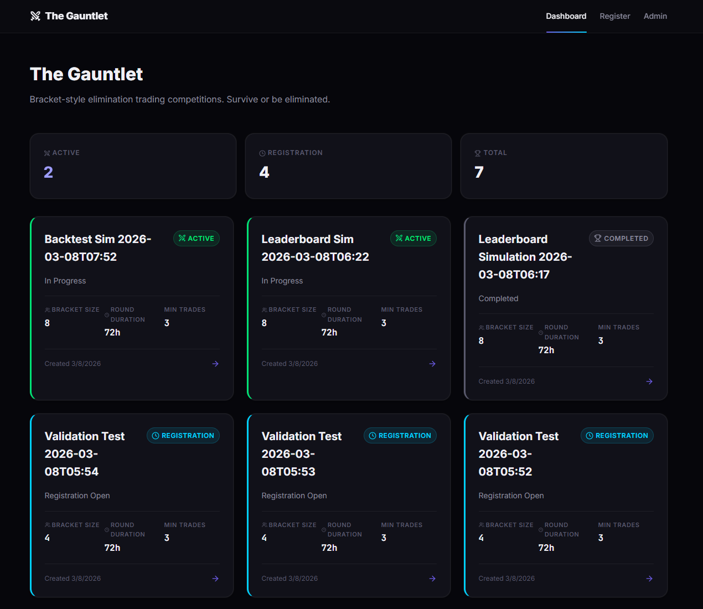
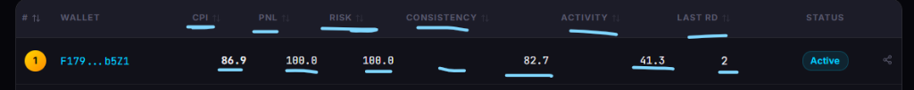

# Adrena: The Gauntlet

A bracket-style elimination trading competition engine built for the [Adrena](https://www.adrena.xyz/) perpetuals protocol on Solana.

Traders register with their wallet, compete in timed rounds, and are scored on a multi-dimensional **Composite Performance Index (CPI)** derived from live Adrena position data. The bottom half of each bracket is eliminated through rounds until a final group of top performers remains. Eliminated traders compete in a single Fallen Fighters consolation pool.

---

## How It Works

1. **Registration** — Traders submit their Solana wallet address. Zero-barrier sign-up: any valid wallet is accepted.
2. **Bracket Formation** — Registered traders are shuffled into brackets of 8 (or placed in seeded order for Season Finals).
3. **Trading Rounds** — Each round runs for a configurable duration (default: 72h, 48h, 48h). Traders trade as they normally would on Adrena.
4. **Scoring** — At the end of each round, positions are fetched from the Adrena API and a CPI score is computed.
5. **Elimination** — The bottom 50% of each bracket is eliminated (except Round 3, which is rank-only). All eliminated traders from R1+R2 enter a single "Fallen Fighters" consolation pool. The top 50% advance in new brackets.
6. **Completion** — After the main bracket and Fallen Fighters round are both scored, the tournament ends.

### CPI Scoring

```
CPI = (0.35 x PnL) + (0.20 x Risk) + (0.30 x Consistency) + (0.15 x Activity)
```

- **PnL**: ROI (PnL / notional USD exposure). Measures profitability.
- **Risk**: Penalizes liquidations and leverage above configurable threshold (default 30x).
- **Consistency**: Profitable days ratio + win rate bonus. Rewards steady green days.
- **Activity**: Trade count, volume, and market diversity (variety weighted 40%).

Full methodology: [docs/competition-design.md](docs/competition-design.md)

---

## Tech Stack

| Layer     | Technology                          |
|-----------|-------------------------------------|
| Backend   | Node.js, Express 5, TypeScript      |
| Database  | PostgreSQL (Neon), Drizzle ORM      |
| Frontend  | Next.js 16, React 19, Vanilla CSS   |
| Data      | Adrena Public HTTP API              |
| Monorepo  | npm workspaces                      |

---

## Screenshots

### Dashboard


### Bracket View — First Blood


### Leaderboard


### Post-Tournament Analytics


---

## Quick Start

### Prerequisites

- Node.js v18+
- PostgreSQL database (Neon recommended)

### Setup

```bash
# Install dependencies
npm install

# Create .env in project root
cp .env.example .env
# Edit .env with your DATABASE_URL and ADMIN_SECRET

# Run database migrations
npm run db:setup

# Start development servers (backend + frontend)
npm run dev
```

- Backend: http://localhost:3001
- Frontend: http://localhost:3000

### Create a Tournament

1. Open http://localhost:3000/admin
2. Enter your admin secret
3. Fill in a tournament name and click "Create"
4. Register wallets on the tournament detail page
5. Use the admin panel to Start, Score, and Advance rounds

---

## Key Features

- **Bracket Elimination** — Traders compete in groups. Bottom 50% eliminated each round.
- **Fallen Fighters** — All eliminated traders compete in a single consolation pool. All participants earn season points.
- **Multi-Dimensional Scoring** — CPI combines PnL, Risk, Consistency, and Activity.
- **Daily Categories** — All Around Trader (diversified ROI) and Top Bottom Fisher (entry timing) award 3/2/1 season points to top 3 daily.
- **Seasons** — Multi-week seasons with aggregate standings, seeded bracket finals, and automatic weekly tournament progression.
- **Configurable Rounds** — Per-round durations, leverage thresholds, and asset counts.
- **Anti-Gaming Filters** — Dust trade, wash trade, and duration filters prevent abuse.
- **Automated Rounds** — Scheduler auto-scores every 15 minutes and auto-advances when rounds end.
- **Share-to-X** — One-click tweet sharing from tournament, leaderboard, and trader profile pages.
- **Post-Tournament Analytics** — Elimination funnel, CPI distribution histograms, component insights, and top performers.

---

## API

17 endpoints covering tournaments, registration, brackets, trader profiles, leaderboards, analytics, and admin actions.

Full reference: [docs/api-reference.md](docs/api-reference.md)

---

## Project Structure

```
adrena-the-gauntlet/
├── packages/
│   ├── backend/           # Express API server
│   │   └── src/
│   │       ├── routes/    # API route handlers (tournaments, registration, brackets, admin, seasons, categories)
│   │       ├── services/  # Business logic (tournament, scoring, scheduler, seasons, daily categories, Adrena client)
│   │       └── db/        # Schema, migrations, connection
│   └── frontend/          # Next.js dashboard
│       └── src/
│           ├── components/ # Shared components (ShareButton)
│           ├── lib/       # API client
│           └── app/       # Pages (dashboard, tournament, analytics, admin, register, leaderboard, trader)
├── docs/                  # Documentation
│   ├── competition-design.md
│   ├── api-reference.md
│   ├── deployment-guide.md
│   └── testing-report.md
└── package.json           # Monorepo root
```

---

## Documentation

| Document | Description |
|----------|-------------|
| [Competition Design](docs/competition-design.md) | Tournament mechanics, scoring, anti-gaming filters, seasons, daily categories |
| [API Reference](docs/api-reference.md) | All endpoints with request/response examples |
| [Deployment Guide](docs/deployment-guide.md) | Setup, environment variables, production build, hosting |
| [Testing Report](docs/testing-report.md) | Engine validation, simulation results, scoring analysis |

---

## License

[MIT](LICENSE)
